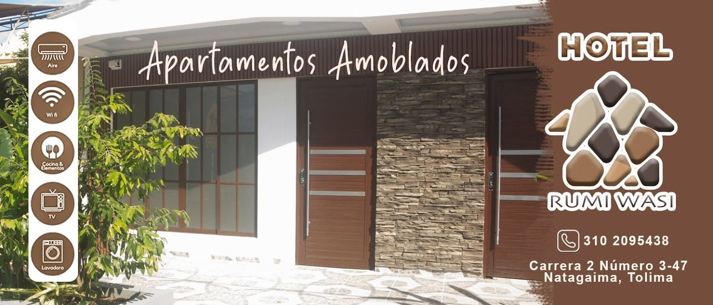
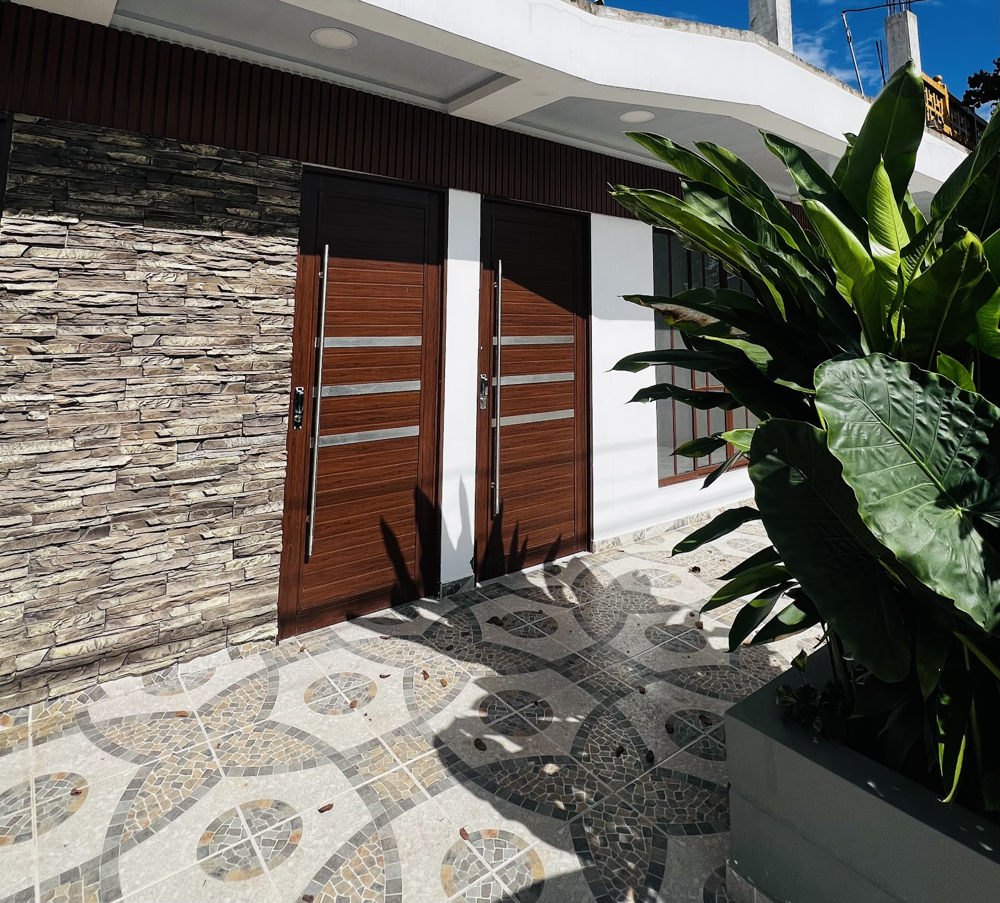
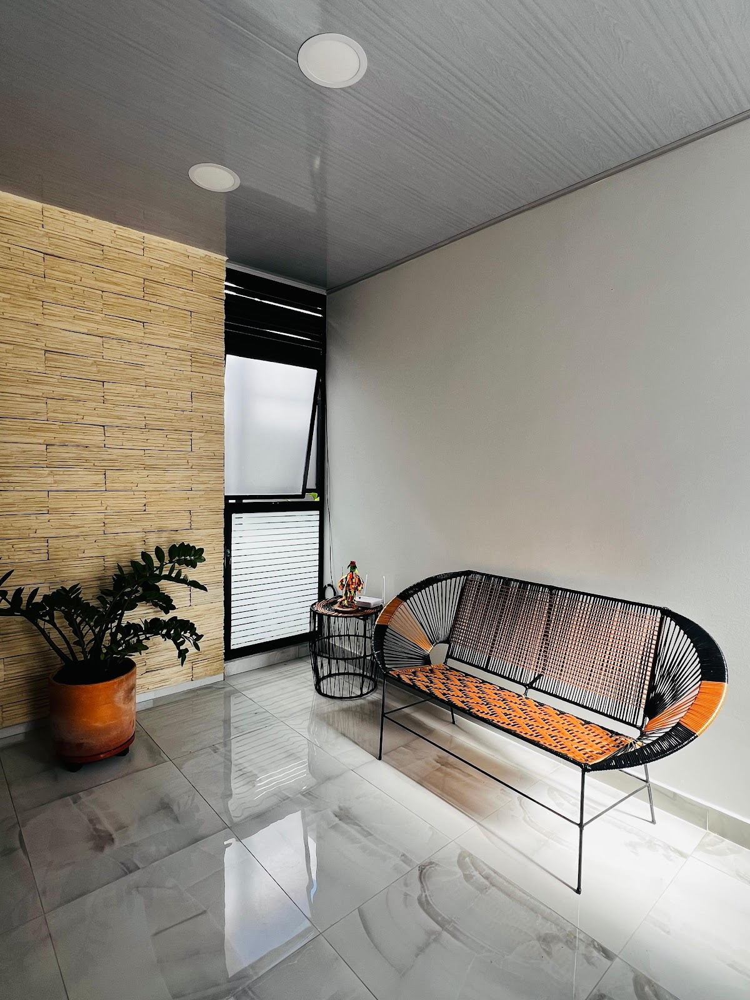
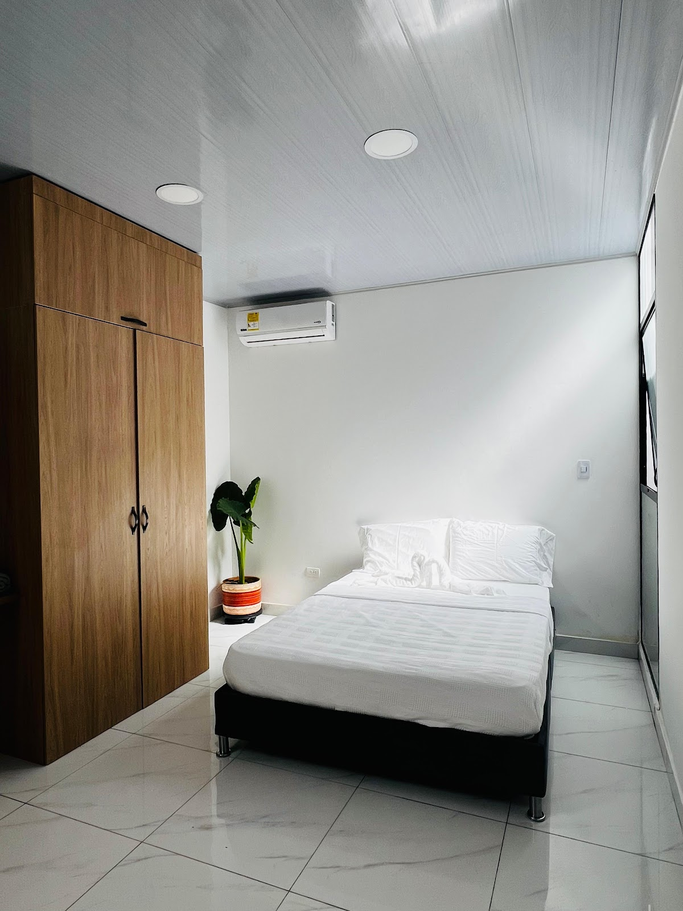
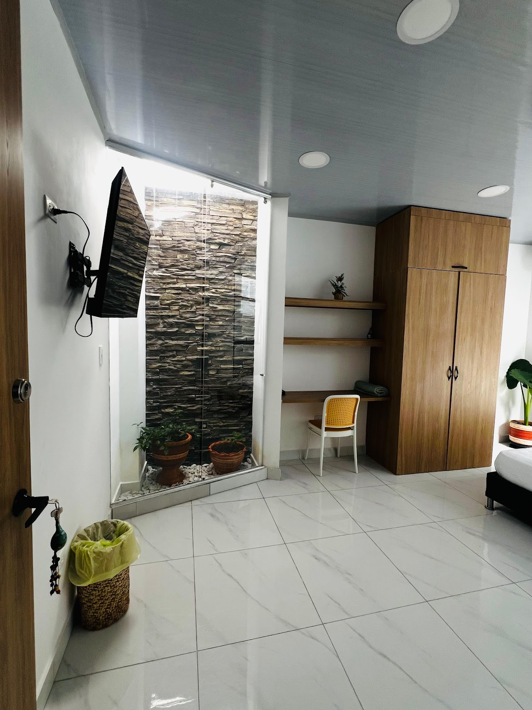
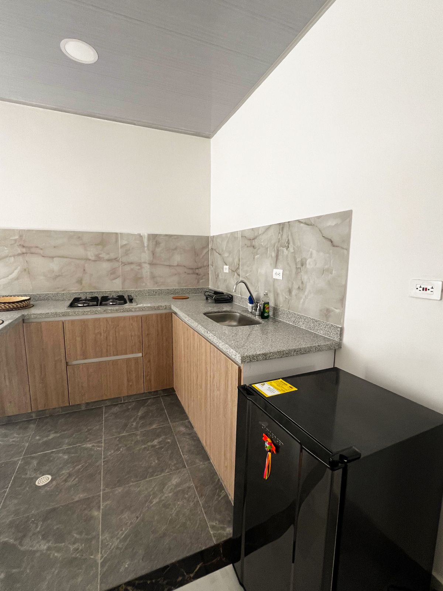
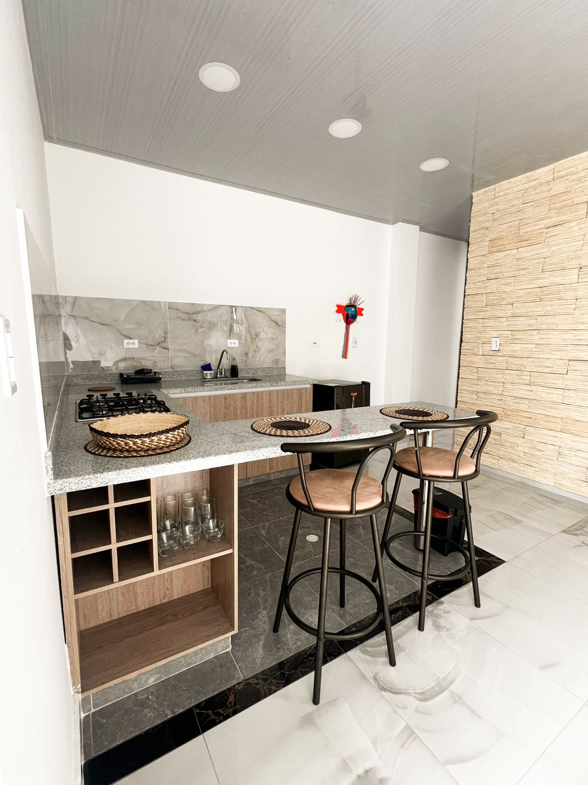
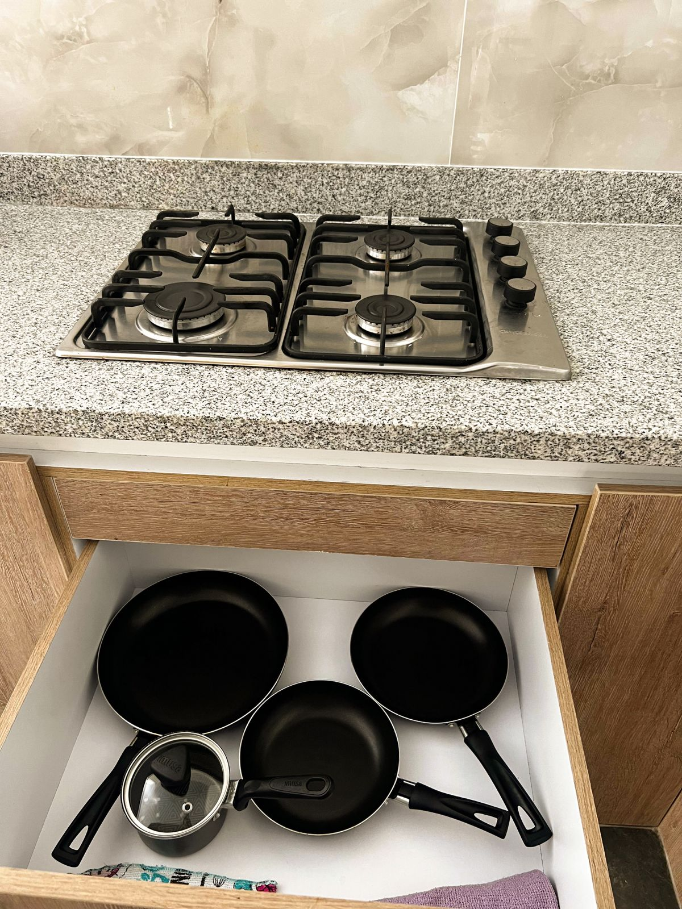
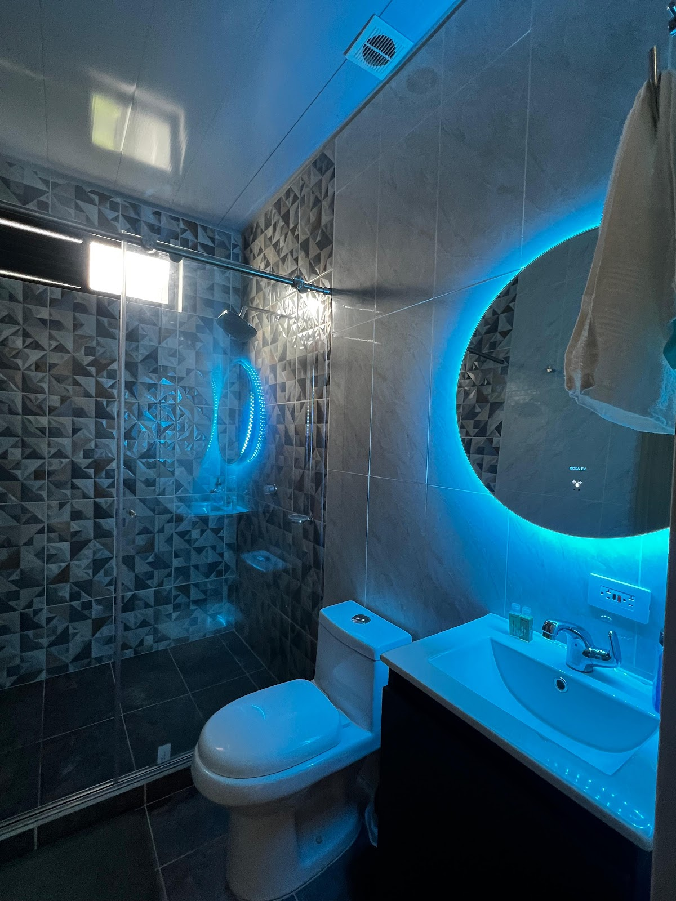
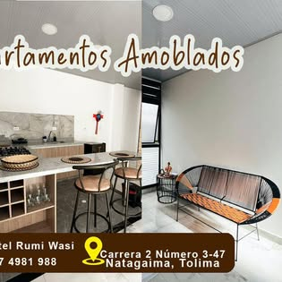

# 🏨 Hotel Rumiwasi - Natagaima, Tolima, Colombia

¡Bienvenido a **Rumiwasi**, tu hogar lejos de casa! Este establecimiento ofrece una experiencia de hospedaje única que combina lo mejor del estilo tradicional y moderno en Natagaima, Tolima. Cuenta con apartamentos completamente amoblados y equipados, ideales para familias, grupos o viajeros que buscan una estadía cómoda, independiente y memorable.

---

## 📌 Información General

| Característica | Detalle |
| :--- | :--- |
| **📍 Dirección** | Carrera 2 #3-47, Natagaima, Tolima, Colombia |
| **📞 Teléfono (Google Maps)** | [+57 317 498 1988](tel:+573174981988) |
| **📞 Teléfono / WhatsApp (Facebook)** | [+57 310 209 5438](tel:+573102095438) |
| **⭐ Calificación** | 4.8 / 5 estrellas (Basado en opiniones en Google Maps) |
| **🏷️ Categoría** | Servicio de hospedaje / Apartamentos Amoblados |
| **🌐 Redes Sociales** | [Facebook Oficial](https://www.facebook.com/people/Hotel-Rumi-Wasi/61569095871140/) |

---

## 🛋️ Servicios y Amenidades

Los apartamentos están diseñados para brindar la máxima comodidad y autonomía a los huéspedes:

* **❄️ Aire Acondicionado:** Climatización en las habitaciones para contrarrestar el clima cálido de Natagaima.
* **📶 Conectividad Wi-Fi:** Acceso a internet inalámbrico de alta velocidad en todo el establecimiento.
* **🍳 Cocina Completamente Equipada:** Estufa, nevera, gabinetes, vajilla, sartenes y utensilios necesarios para preparar tus propias comidas.
* **📺 Entretenimiento:** Televisores de pantalla plana en las habitaciones.
* **🧺 Zona de Lavandería:** Lavadora disponible dentro del apartamento.
* **🛋️ Áreas Comunes:** Cómodas salas de estar, zonas de comedor y balcones con vista exterior.

---

## 🏊‍♂️ Aclaración Importante: Acceso a Piscina

* **¿El Hotel Rumiwasi cuenta con piscina?**
  **No.** El hotel no dispone de piscina, jacuzzi ni gimnasio en sus instalaciones.
* **Detalle:** De acuerdo con los registros locales y descripciones del establecimiento, se prioriza el alojamiento independiente en apartamentos amoblados y equipados. A menudo se le confunde con el *Hotel Boutique Natagaima / Centro Recreacional La Piscina*, el cual sí cuenta con zona húmeda, pero es un establecimiento diferente.

---

## 📷 Galería de Fotos y Publicidad

Todas las imágenes mostradas a continuación han sido descargadas localmente en la carpeta `./imagenes` para tu conveniencia:

### Fachada y Logotipo
| Logotipo / Publicidad | Fachada Principal |
| :---: | :---: |
|  |  |

### Interiores de los Apartamentos
| Sala y Balcón | Habitación Principal | Habitación con Escritorio |
| :---: | :---: | :---: |
|  |  |  |

### Cocina y Comedor
| Vista General de Cocina | Barra de Cocina | Estufa y Gabinetes |
| :---: | :---: | :---: |
|  |  |  |

### Baño e Imágenes Adicionales
| Baño del Apartamento | Perfil de Facebook | Portada de Facebook |
| :---: | :---: | :---: |
|  |  |  |

---

## 💬 Resumen de Opiniones (Google Maps)

El hotel cuenta con una excelente reputación entre sus visitantes, destacando:
1. **Limpieza y Orden:** Los apartamentos son entregados en perfectas condiciones de aseo.
2. **Equipamiento:** Los huéspedes valoran mucho el contar con cocina y lavadora en sus estadías largas.
3. **Ubicación:** Central y accesible en Natagaima.
4. **Atención:** Hospitalidad y buen trato por parte del personal o propietarios.
